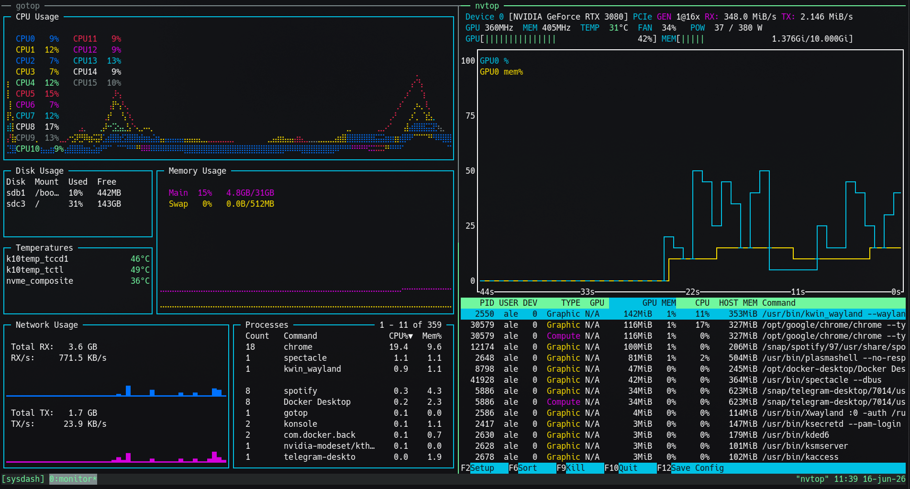
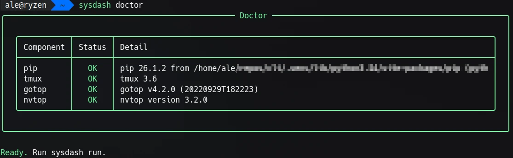
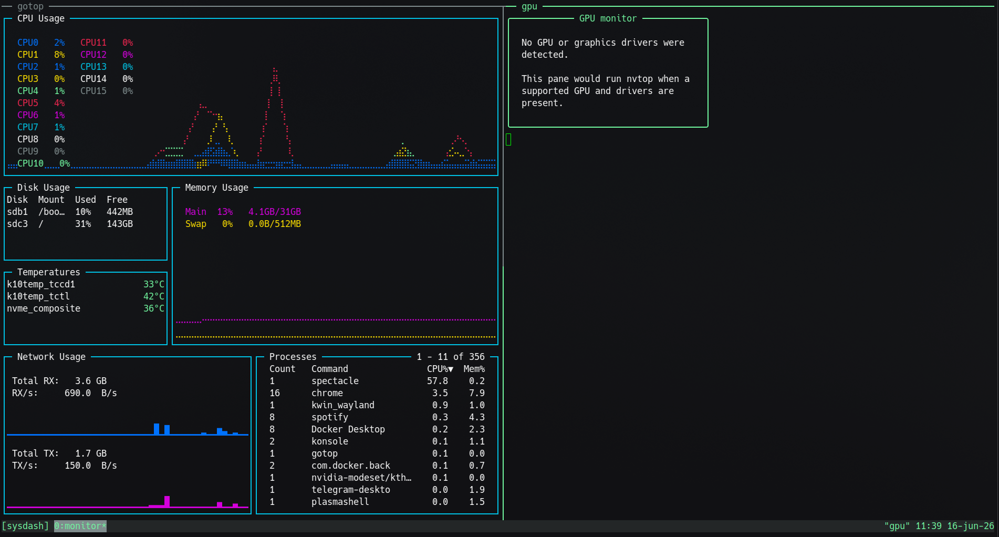

# sysdash

`gotop` and `nvtop` in one terminal, split with tmux.

Tested on **Ubuntu 26.04 LTS**. Linux only.



## Install

```bash
git clone https://github.com/als-code/sysdash.git
cd sysdash
./install.sh
```

`install.sh` creates a venv, installs dependencies, and links `sysdash` into `~/.local/bin`.

Requires `sudo` for system packages (`tmux`, `gotop`, and `nvtop` when a GPU is detected).

## Usage

```bash
sysdash             # open dashboard
sysdash --stop      # kill tmux session
sysdash doctor      # check dependencies
```



| Key | Action |
|-----|--------|
| `Ctrl+C` | Close the whole dashboard |
| `Ctrl+b` `d` | Detach (session keeps running) |

Without a GPU or drivers, the right pane shows a status message instead of nvtop.

<details>
<summary>No GPU — status pane instead of nvtop</summary>



</details>

## Distro support

| Distro | Package manager | Status |
|--------|-----------------|--------|
| Ubuntu / Debian | `apt`, `nala` | Tested (26.04 LTS) |
| Fedora | `dnf` | Not tested — [open an issue](https://github.com/als-code/sysdash/issues) |
| Arch | `pacman` | Not tested — [open an issue](https://github.com/als-code/sysdash/issues) |

`gotop` is installed from snap or a GitHub release when it is missing from your repos.

## Third-party tools

sysdash is a wrapper around:

| Tool | Repository | License |
|------|------------|---------|
| [gotop](https://github.com/xxxserxxx/gotop) | process monitor | AGPL-3.0 |
| [nvtop](https://github.com/Syllo/nvtop) | GPU monitor | GPL-3.0-or-later |
| [tmux](https://github.com/tmux/tmux) | terminal multiplexer | ISC |

sysdash itself is licensed under **GPL-3.0-or-later** (see [LICENSE](LICENSE)).

## Changelog

See [CHANGELOG.md](CHANGELOG.md).
